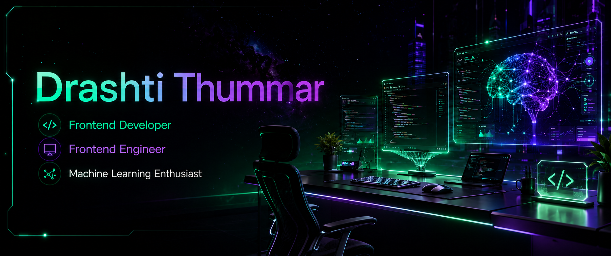

<p align="center">
  
</p>

<div align="center">
  
</div>

<p align="center">
  
</p>

<h1 align="center">
Hi 👋 I'm <b>Drashti Thummar</b>
</h1>

<h3 align="center">
💻 Frontend Developer • 🎓 BCA Student • 🧠 Machine Learning Enthusiast
</h3>

<p align="center">
Building intelligent web applications and AI-powered solutions with modern technologies,
clean architecture, and exceptional user experiences.
</p>

<hr style="border:0; height:1px; width:90%; margin:18px auto; background:linear-gradient(90deg, transparent, #22E6A8 25%, #8B5CF6 50%, #06B6D4 75%, transparent); opacity:0.8;">

# 🚀 About Me

<p align="center">
<i>
Transforming ideas into intelligent software through clean code, creativity, and AI innovation.
</i>
</p>

<table align="center" border="white">
<tr width="100%">

<td width="60%">
<br>

```yaml
👩 Name: Drashti Thummar
💼 Role: Front End Developer 
📍 Based In: India
🎓 Degree: Bachelor of Computer Applications
🚀 Specialization:  Front End Developer • Machine Learning
💻 Current Focus: Frontend AI Engineering Internship
🎯 Mission: Creating impactful AI-powered digital experiences
```

- 🚀 Building scalable and modern web applications.
- 🤖 Developing AI-powered solutions with practical impact.
- 📚 Continuously learning emerging technologies.
- 💡 Passionate about clean code, UI/UX, and problem solving.
- 🌍 Open to collaboration on innovative software projects.
- 📬 Reach me: **thummard097gmail.com**

<br>
</td>

<td width="40%" align="center">


</td>

</tr>
</table>

<hr style="border:0; height:1px; width:90%; margin:18px auto; background:linear-gradient(90deg, transparent, #22E6A8 25%, #8B5CF6 50%, #06B6D4 75%, transparent); opacity:0.8;">

# 💻 Tech Stack

<table align="center">
<tr>
<td align="center">


</td>
</tr>
</table>

<p align="center">
  <i>Building modern web applications with AI-powered technologies.</i>
</p>

<hr style="border:0; height:1px; width:90%; margin:18px auto; background:linear-gradient(90deg, transparent, #22E6A8 25%, #8B5CF6 50%, #06B6D4 75%, transparent); opacity:0.8;">


# 🚀 Featured Projects

<table>
<tr>
<td>

### 🌐 Portfolio Website

A personal portfolio website designed to showcase my skills, projects and frontend development journey.

**Key Features**  
`Responsive Design` · `Modern UI` · `Project Showcase` · `Mobile Friendly`

**Built With**  
`HTML` `CSS` `Bootstrap` `JavaScript`

**Live:** [View Portfolio](https://drash011.github.io/Portfolio)

</td>
</tr>

<tr>
<td>

### 🎵 Spotify UI Clone

A Spotify-inspired frontend interface created to practice modern layouts, navigation, cards and responsive design.

**Key Features**  
`Music Dashboard` · `Playlist UI` · `Navigation` · `Responsive Layout` · `Modern Cards`

**Built With**  
`HTML` `CSS` `Bootstrap` `JavaScript`

**Live:** [View Spotify UI](https://drash011.github.io/Spotify)

</td>
</tr>

<tr>
<td>

### 🩺 CarePlus

A healthcare-focused website designed with a clean interface for exploring doctors and healthcare services.

**Key Features**  
`Doctor Sections` · `Appointment UI` · `Healthcare Design` · `Responsive Layout`

**Built With**  
`HTML` `CSS` `Bootstrap` `JavaScript`

**Live:** [View CarePlus](https://drash011.github.io/CarePlus/)

</td>
</tr>

</table>

<hr style="border:0; height:1px; width:90%; margin:18px auto; background:linear-gradient(90deg, transparent, #22E6A8 25%, #8B5CF6 50%, #06B6D4 75%, transparent); opacity:0.8;">

# 📊 GITHUB ACTIVITY

<table align="center">
<tr>

<td width="50%" align="center">


</td>

<td width="50%" align="center">


</td>

</tr>
</table>

<br>

<p align="center">
  
</p>

<hr style="border:0; height:1px; width:90%; margin:18px auto; background:linear-gradient(90deg, transparent, #22E6A8 25%, #8B5CF6 50%, #06B6D4 75%, transparent); opacity:0.8;">

# 💬 Developer Mindset

<div align="center">

### 💜 *"The best way to predict the future is to build it."*

</div>

<hr style="border:0; height:1px; width:90%; margin:18px auto; background:linear-gradient(90deg, transparent, #22E6A8 25%, #8B5CF6 50%, #06B6D4 75%, transparent); opacity:0.8;">

# 🌐 Connect With Me

<p align="center">
  <a href="https://www.linkedin.com/in/drashti-thummar-07b847389/">
    
  </a>
  &nbsp;
  <a href="mailto:thummard097@gmail.com">
    
  </a>
  &nbsp;
  <a href="https://github.com/Drash011">
    
  </a>
</p>

<hr style="border:0; height:1px; width:90%; margin:25px auto; background:linear-gradient(90deg, transparent, #22E6A8 25%, #8B5CF6 50%, #06B6D4 75%, transparent); opacity:0.8;">

<div align="center">

### ⭐ Thanks for visiting my profile ⭐

<i>Made with ❤️ by <b>Drashti Thummar</b></i>

<br>

💻 <b>Frontend Developer</b> &nbsp;•&nbsp; 🧠 <b>Machine Learning Enthusiast</b>

</div>

<hr style="border:0; height:1px; width:90%; margin:25px auto; background:linear-gradient(90deg, transparent, #22E6A8 25%, #8B5CF6 50%, #06B6D4 75%, transparent); opacity:0.8;">
