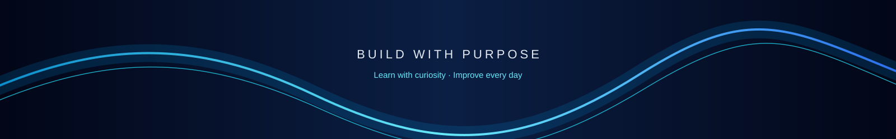

  

<a href="https://github.com/Drash011">GitHub</a>
&nbsp;&nbsp;·&nbsp;&nbsp;
<a href="https://www.linkedin.com/in/drashti-thummar-07b847389">LinkedIn</a>
&nbsp;&nbsp;·&nbsp;&nbsp;
<a href="mailto:thummard097@gmail.com">Email</a>

 

---

## ABOUT ME

I'm **Drashti Thummar**, a **BCA student and aspiring Frontend Developer** who enjoys building modern, responsive, and interactive web experiences.

My primary focus is frontend development, especially creating interfaces that are **clean, responsive, visually appealing, and easy to use**.

I believe in learning through practice — taking concepts, turning them into projects, debugging what doesn't work, and continuously improving.

`LEARN` → `BUILD` → `DEBUG` → `IMPROVE`

---

## WHAT I DO

<table>
<tr>
<td width="33%" align="center">

### FRONTEND

Building responsive websites and modern interfaces using HTML, CSS, Bootstrap and JavaScript.

</td>
<td width="33%" align="center">

### JAVASCRIPT

Working with DOM manipulation, events, functions, logic and interactive web experiences.

</td>
<td width="33%" align="center">

### PROBLEM SOLVING

Strengthening programming fundamentals and logical thinking through practical projects.

</td>
</tr>
</table>

---

## TECH STACK

 

### FRONTEND DEVELOPMENT

 

**HTML5** &nbsp; · &nbsp; **CSS3** &nbsp; · &nbsp; **Bootstrap** &nbsp; · &nbsp; **JavaScript** &nbsp; · &nbsp; **TypeScript**

  

### PROGRAMMING & DEVELOPMENT TOOLS

 

**C** &nbsp; · &nbsp; **C++** &nbsp; · &nbsp; **Git** &nbsp; · &nbsp; **GitHub** &nbsp; · &nbsp; **VS Code**

  

---

## FEATURED PROJECTS

### Projects built while learning, experimenting and improving.

 

### Portfolio Website

A personal portfolio website designed to showcase my skills, projects and frontend development journey.

**Key Features**  
`Responsive Design` · `Modern UI` · `Project Showcase` · `Mobile Friendly`

**Built With**  
`HTML` `CSS` `Bootstrap` `JavaScript`

**Live:** [View Portfolio](https://drash011.github.io/Portfolio)

---

### Spotify UI Clone

A Spotify-inspired frontend interface created to practice modern layouts, navigation, cards and responsive design.

**Key Features**  
`Music Dashboard` · `Playlist UI` · `Navigation` · `Responsive Layout` · `Modern Cards`

**Built With**  
`HTML` `CSS` `Bootstrap` `JavaScript`

**Live:** [View Spotify UI](https://drash011.github.io/Spotify)

---

### CarePlus

A healthcare-focused website designed with a clean interface for exploring doctors and healthcare services.

**Key Features**  
`Doctor Sections` · `Appointment UI` · `Healthcare Design` · `Responsive Layout`

**Built With**  
`HTML` `CSS` `Bootstrap` `JavaScript`

**Live:** [View CarePlus](https://drash011.github.io/CarePlus/)

---

**More projects are currently in progress.**

---

  <h2>LEARNING & GROWTH</h2>

| Learning | Focus |
|:---|:---|
| **HTML & CSS** | Structure · Layouts · Responsive Design |
| **Bootstrap** | Components · Responsive Interfaces |
| **JavaScript** | Logic · Functions · DOM · Events |
| **Git & GitHub** | Version Control · Repositories |
| **Problem Solving** | Logic Building · Programming Fundamentals |

---

  <h2>CURRENT FOCUS</h2>

| JavaScript | UI Development | Projects | Growth |
|:---:|:---:|:---:|:---:|
| Logic, DOM and events | Cleaner responsive interfaces | Practical applications | Learning through every project |

---

## GITHUB ACTIVITY

  

---

## GITHUB ACHIEVEMENTS

---

## CONTRIBUTION ACTIVITY

---

## MY DEVELOPMENT APPROACH

### LEARN → BUILD → BREAK → DEBUG → IMPROVE → BUILD BETTER

 

`LEARN` → `BUILD` → `BREAK` → `DEBUG` → `IMPROVE` → `GROW`

  

I don't aim to know everything. I aim to learn something new with every project.

---

## LET'S CONNECT

I'm open to **learning, collaboration, frontend projects and new opportunities.**

  

[GitHub](https://github.com/Drash011) · [LinkedIn](https://www.linkedin.com/in/drashti-thummar-07b847389) · [Email](mailto:thummard097@gmail.com)

  

